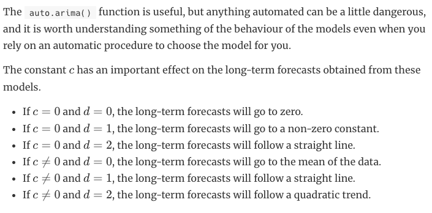

# Data analysis 2 project

## Loading Data

```{r}
project_data <- read.csv("data/combined_data_hourly.csv",header = T)
```

## Basic EDA

```{r}
summary(project_data)
boxplot(project_data$RT_Demand)
pairs(project_data[,3:ncol(project_data)])
```

## Visualization

```{r}
library(ggplot2)
p <- ggplot(project_data,mapping=aes(x=Date,y=DA_EC))

p + geom_line()
```

```{r}
pairs(project_data[,3:ncol(project_data)])
```

```{r}

```

## SARIMA on the data

```{r}
library(forecast)
forecast_model <- auto.arima(project_data$RT_Demand,seasonal = T)
summary(forecast_model)
```

Something to note. The SARIMA model assumes that all of the data necessary to forecast future values is captured by the data in history. Here we will try to forecast RT_DEMAND. But, the other factors present in the dataset are not used. Only, checking for seasonality and trends. It makes sense that a fourier series representation is used here. I understand why people consider this problem a curve fitting problem. The issue is that the method is unlikely to be very interpretable.

## SARIMA now with cross validation

### Pre-processing

```{r}
#install.packages("tibble")
library(forecast)
library(timetk)
library(lubridate)
project_data <- read.csv("data/combined_data_hourly.csv",header = T)
project_data <- project_data[project_data$Date > "2018-12-31",]
#project_data
project_data$Date_Time <- ymd(as.Date(project_data$Date)) + hours(as.double(project_data$Hr_End) - 1)  # marking by start hour even though the time period is the same
# reason is to keep all data within the day it belongs to for later selection
#which(is.na(project_data))
#colSums(is.na(project_data))
#project_data[which(is.na(project_data$Date_Time)),c("Date","Hr_End")]

project_data <- project_data[-which(is.na(project_data$Date_Time)),]
#colSums(is.na(project_data)) #problem solved
```

We also drop the first three years since the way the features were measured changed in June of 2018. We start the data in 2019 for consistency.

When creating the Date_Time variable for time series marker an issue of a NA value emerged as a result of how the daylight savings hours are recorded. In November of 24 on the third of the month an 02X representing the lost hour of spring forward is present in the data. This is also true for 11/2/25 but not present in the earlier years. It seems from ISO changed their standard. Which has been true for a few things. In this case I am going to drop these two rows only to remain consistent with the other years. Since we are fitting a model, I don't think this will play too significant an impact on model performance, but may come into play for a particular case later. I just want to note it.

### Cross validation splitting and test set hold out

For the SARIMA model, I only need the response variable itself and the time data. So I will create a subset of the data to serve as my complete data with that.

```{r}
sarima_subset <- project_data[,c("Date","Date_Time","RT_Demand")]
head(sarima_subset)

sarima_subset

sarima_subset.Train <- sarima_subset[sarima_subset$Date < "2025-01-01",]

sarima_subset.Test <-  sarima_subset[sarima_subset$Date >= "2025-01-01",]
```

Now to set up a sliding window cross validation with one year of training and one year of testing for each SARIMA instance.

```{r}
library(dplyr)
library(ggplot2)

plot_subset <- sarima_subset[sarima_subset$Date >= "2025-01-01",]

ggplot(plot_subset,aes(x=Date_Time,y=RT_Demand)) + geom_line(color="#0072CE") + theme_bw() + labs(title="Hourly RT_Demand of Energy in MW for SEMA 2025",x="",y="RT_Demand (MW)")

radial_heat_map_df <- sarima_subset %>% mutate(
    year = year(Date_Time),
    month = month(Date_Time),
    week = isoweek(Date_Time),
    day_of_week = wday(Date_Time, label = FALSE),
    hour = hour(Date_Time)
  )

yearly_agg <- radial_heat_map_df %>%
  group_by(year, week) %>%
  summarise(RT_Demand = mean(RT_Demand), .groups = "drop")

ggplot(yearly_agg, aes(x = week, y = factor(year), fill = RT_Demand)) +
  geom_tile() +
  scale_x_continuous(breaks = c(1, 5, 9, 14, 18, 22, 27, 31, 36, 40, 44, 48),labels = month.abb)+
  coord_polar(start = 0) +
  scale_fill_gradient(low = "white", high = "#0072CE") + 
  labs(title = "Yearly RT_Demand by Week") +
  theme_void() +
  theme(
  legend.position = "bottom",
  axis.text.x = element_text(size = 8)
)

```

```{r}
library(forecast)
library(lubridate)
library(timetk)
library(rsample)
library(tibble)
library(plotly)

sliding_window_cv <- time_series_cv(data=as_tibble(sarima_subset.Train),date_var = Date_Time, initial="2 years", assess = "24 hours", skip= "3 days",cumulative = F, slice_limit = 4)

expanding_cv <- time_series_cv(data=as_tibble(sarima_subset.Train),date_var = Date_Time, initial="2 years", assess = "24 hours", skip= "3 days",cumulative = T, slice_limit = 4)

library(timetk)
library(ggplot2)
library(patchwork)
library(dplyr)

# replace RT_Demand with your actual value column name
value_col <- "RT_Demand"

p_slide <- sliding_window_cv %>%
  tk_time_series_cv_plan() %>%
  plot_time_series_cv_plan(
    .date_var    = Date_Time,
    .value       = !!sym(value_col),
    .title       = "Sliding Window",
    .interactive = FALSE
  ) +
  theme(legend.position = "none",
        axis.text.y = element_blank(),
        axis.ticks.y = element_blank(),
        axis.title.y = element_blank())

p_expand <- expanding_cv %>%
  tk_time_series_cv_plan() %>%
  plot_time_series_cv_plan(
    .date_var    = Date_Time,
    .value       = !!sym(value_col),
    .title       = "Expanding Window",
    .interactive = FALSE
  ) +
  theme(axis.text.y = element_blank(),
        axis.ticks.y = element_blank(),
        axis.title.y = element_blank())

# stacked for the tall left placeholder
p_slide / p_expand +
  plot_annotation(title = "Cross-Validation Fold Structure")
```

NOTE: sliding window for things like SARIMA dont follow random sampling idea from standard CV and for time series models that rely on seasonality you run into the issue of not providing enough season period.

The testing window was selected to be one year to ensure that the test batch size was consistent across methods. This was to ensure the sampling distribution of the test error evaluation was closer between models reducing an element of variation in the data, essentially reducing degrees of freedom. Additionally, SARIMA benefits from capturing one degree of seasonality so a year was chosen to capture the yearly season mode. Testing batch sizes were selected to be two years to allow the fitting data to retain many examples of seasons relative to the data size.

#### Limitation

A note on seasons. Going forward, I define the notion of "frequency" to be a periodic pattern (fixed time interval period) in the data for a given time frame. For example, the daily frequency results from periodic fluctuations in the data by hour. Daily peak demand is a recurring periodic pattern within these data (*provide evidence for this)*. Another example on the upper bound includes yearly seasonal behavior. Within a year of data, the quarterly fluctuations in the local climate, which from the initial study last semester was shown to impact energy demand behavior via HDD and CDD (*cite yourself)*, although the results of that examination are questionable, considering the impact of this information in this context is important *potentially weak claim explore this further*.

For this data, we have the option to select daily season since there is a frequency mode of daily peak. Additionally, we have the weekly peaks due to weekday vs weekend resulting in another frequency mode. And finally, we have the yearly season fluctuations. For the purposes of this analysis, we focus on weekly seasonal behavior. The rationale is simplicity. In practice, a more rigorous analysis of the important frequency modes should go into the model design process, but for the sake of time and scope of this project, I just wanted to get an example of how to run this analysis. Going forward, I want to expand this part of the project. In fact, SARIMA is known to be limited in that the model can only assume one seasonal mode in the data. Models like meta's prophet allow for different seasonal frequencies through Fourier series expansions of the data. However, that is not explored here.

### Hyper-parameter search



pseudo-citation: <https://otexts.com/fpp2/non-seasonal-arima.html>

#### Limitation

They explain some of the techniques for selecting these things yourself, but I am taking the approach of an optimization idea since my goal is to maximize predictive power. Yet, I understand that the optimization approach may not work. Back when we studied the examples of optimization ideas, we had many assumptions needed to be met to guarantee existence of an optimal point. I don't know if I have that here. I could try and examine that analytically, but for the sake of time we can chalk that up to another limitation. I don't necessarily need a PhD project to explore this problem, but having the time to fill those gaps would help. I don't know if that is a high value effort though.

I am deciding to use auto.arima because I don't yet know how this works. I see that limiting the project too much could make it not useful. This is a first attempt. Hard to know what the line is. From a risk standpoint, using auto.arima may not hurt me too much. It does well for data that meet the assumptions. If the behavior is extremely poor, it may be because this isn't the right tool for the job.

```{r}
get_cv_fold_metrics <- function(split,time_interval=24){
  fold_training <- training(split)
  fold_validation <- testing(split)
  fold_time_series <- ts(fold_training$RT_Demand,frequency = time_interval)
  fold_model <- auto.arima(fold_time_series,seasonal = T,stepwise = T,approximation = T,trace=F)
  
  h <- nrow(fold_validation)
  split_forecast <- forecast(fold_model,h)
  
  observed <- fold_validation$RT_Demand
  predictions <- as.numeric(split_forecast$mean)
  
  rmse = sqrt(mean((observed - predictions)^2))
  AIC.fold <- split_forecast$aic
  
  return(list(model_order = arimaorder(fold_model), rmse=rmse, foldaic = AIC.fold ,observed = observed, predicted = predictions))
}

print(paste("CV Sliding for SARIMA"))
sliding_results <- list()
for (i in seq_along(sliding_window_cv$splits)){
  print(paste("Fold", i, "\n"))
  sliding_results[[i]] <- get_cv_fold_metrics(sliding_window_cv$splits[[i]])
}

print(paste("CV Cummulative for SARIMA"))
expanding_results <- list()
for (i in seq_along(expanding_cv$splits)){
  print(paste("Fold", i, "\n"))
  expanding_results[[i]] <- get_cv_fold_metrics(expanding_cv$splits[[i]])
}

```

```{r}
library(dplyr)
sliding_results <- readRDS("24_hr_cv_sliding_results.rds")
expanding_results <- readRDS("24_hr_cv_expanding_results.rds")

# Combined dataframe with RMSE and order per fold
cv_summary <- data.frame(
  fold = rep(1:length(sliding_results), 2),
  rmse = c(
    sapply(sliding_results, \(x) x$rmse),
    sapply(expanding_results, \(x) x$rmse)
  ),
  order = c(
    sapply(sliding_results, \(x) paste(x$model_order, collapse = ",")),
    sapply(expanding_results, \(x) paste(x$model_order, collapse = ","))
  ),
  cv_type = rep(c("Sliding", "Expanding"), each = length(sliding_results))
)

# Average RMSE per CV strategy
avg_rmse <- cv_summary %>%
  group_by(cv_type) %>%
  summarize(avg = mean(rmse))

# Plot
library(ggplot2)
ggplot(cv_summary, aes(x = fold, y = rmse, color = cv_type)) +
  geom_line() +
  geom_point() +
  geom_hline(data = avg_rmse, aes(yintercept = avg, color = cv_type), linetype = "dashed") +
  labs(x = "Fold", y = "RMSE", title = "RMSE per Fold by Method") +
  theme_minimal()
```

```{r}
# Best order per CV strategy (by mean RMSE, filtered to orders with >= 5 folds)
best_orders <- cv_summary %>%
  group_by(cv_type, order) %>%
  summarise(
    n_folds = n(),
    avg_rmse = mean(rmse),
    .groups = "drop"
  ) %>%
  filter(n_folds >= 5) %>%
  arrange(cv_type, avg_rmse)

best_orders
```

Expanding did better which makes sense since more historical data means a better fit. This is an estimate of the model selection process and expanding with the auto arima basedo n

Post discussion and continued learning

Further analysis reveals that we are actually estimating the the model selection process of using auto.arima with AIC to and the stated hyperparams to the modeling process. This is cool and unique to what I was expecting. But, it does mean that the final model fitting is better served by running the same auto.arima now with the full data set.

so we will make a change to the testing process now that refits the model for every test. This essentially now acts like a leave one out procedure for the out of sample tests. We will have to see how that looks at the end. I think that the analysis between the models will be a little bit more nuanced than I expect right now.

```{r}
library(forecast)

train_data <- sarima_subset.Train$RT_Demand
test_data <- sarima_subset.Test$RT_Demand
test_dates <- sarima_subset.Test$Date_Time

n_days <- 365
all_predictions <- numeric(n_days * 24)

for (i in 1:n_days) {
  # Build ts from all available data up to this point
  current_ts <- ts(train_data, frequency = season_frequency)
  
  # Fit model
  fit <- auto.arima(current_ts,seasonal = T,stepwise = T,approximation = T,trace=F)
  
  # Forecast next 24 hours
  fc <- forecast(fit, h = 24)
  
  # Store predictions
  idx <- ((i - 1) * 24 + 1):(i * 24)
  all_predictions[idx] <- as.numeric(fc$mean)
  
  # Append actual observations to training data for next iteration
  train_data <- c(train_data, test_data[idx])
  
  if (i %% 50 == 0) cat("Day", i, "of", n_days, "\n")
}
saveRDS(all_predictions,"SARIMA_TEST_PREDICTIONS.rds")
# Evaluate
observed <- test_data
rmse <- sqrt(mean((observed - all_predictions)^2))
cat("Rolling 24h RMSE:", rmse, "\n")

length(observed)
length(all_predictions)

# Plot
visualization <- data.frame(
  Actual = observed,
  Predicted = all_predictions[1:length(all_predictions) - 1],
  Dates = test_dates
)

ggplot(visualization, aes(Dates)) +
  geom_line(aes(y = Actual), color = "blue") +
  geom_line(aes(y = Predicted), color = "gold") +
  theme_bw()

rmse

ss_res = mean(((observed-all_predictions[1:length(all_predictions) - 1])^2))
ss_tot = var(observed)
r_sqr = 1 - (ss_res/ss_tot)
ggplot(visualization,aes(x=Actual,y=Predicted)) + geom_point(alpha=0.3,size=0.3) + geom_smooth(method="lm", se=T) + labs(x = ) + theme_bw()

mean(sarima_subset.Test$RT_Demand)
var(sarima_subset.Test$RT_Demand)
summary(project_data)

ggplot(project_data, aes(x=RT_Demand, y = "")) + geom_boxplot(fill="steelblue",col="black") + theme_classic() + labs(title="Distribution of RT_Demand", subtitle = "SEMA 2019 - 2025", x="") + theme(axis.title.y=element_blank(),
        axis.text.y=element_blank(),
        axis.ticks.y=element_blank())
```

```{r}
library(patchwork)
p_top <- ggplot(visualization, aes(x = Dates)) +
  geom_line(aes(y = Actual,    color = "Actual"),    linewidth = 0.4) +
  geom_line(aes(y = Predicted, color = "Predicted"),
            linetype = "dashed", linewidth = 0.4) +
  scale_color_manual(values = c("Actual" = "steelblue", "Predicted" = "red")) +
  labs(
    title    = "Final Model | 2025 Holdout | Rolling 24h Forecast",
    subtitle = sprintf("RMSE: %.1f MW | R\u00b2: %.3f", rmse, r_sqr),
    x = "Hour", y = "RT Demand (MW)", color = NULL
  ) +
  theme_classic() +
  theme(legend.position = c(0.92, 0.85),
        legend.background = element_rect(fill = "white", color = "black"))


p_bot <- ggplot(visualization, aes(x = Actual, y = Predicted)) +
  geom_point(alpha = 0.3, size = 0.3, color = "steelblue") +
  geom_abline(slope = 1, intercept = 0, color = "red", linetype = "dashed") +
  labs(
    title    = "Final Model | 2025 Holdout | Actual vs Predicted",
    subtitle = sprintf("R\u00b2: %.3f", r_sqr),
    x = "Actual RT Demand (MW)", y = "Predicted RT Demand (MW)"
  ) +
  theme_classic()

(p_top / p_bot) + plot_annotation(
  title = "SARIMA",
  theme = theme(plot.title = element_text(size = 20, face = "bold", hjust = 0.5))
)
```

But a value on its own may not be that comparable so lets look at the plot of predictions vs results

There may be over fitting here. I don't know how 270 MW RMSE compares to other models. There may be instances like sudden spikes that the model may not be able to handle. Right now the model looks at a 24 hour look ahead. If we are to trust the model fitting procedures order params

## Post analysis

Ljung-box test is important for making sure the autocorrelation is there

```{r}
Box.test(all_predictions[1:length(all_predictions) - 1],lag=3,type = "Ljung-Box")
arimaorder(fit)
```
